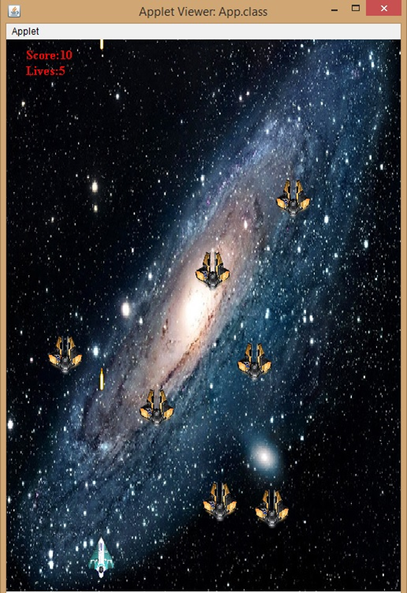

# SpaceWars Java Applet 2d Game

## Introduction
A 2d game I made a while back during my bachelors degree. It was made using Java applet. This no longer works on web browsers as support for java has been dropped. You can still run it on your system if you have Java installed. A version of this coded in JavaScript that runs on modern web browsers is now uploaded to this GitHub repo [SpaceWarsV2](https://github.com/MusabNaik/SpaceWarsV2). Live demo can be accessed at this [link](https://musabnaik.github.io/SpaceWarsV2/index.html)

## Screenshots

